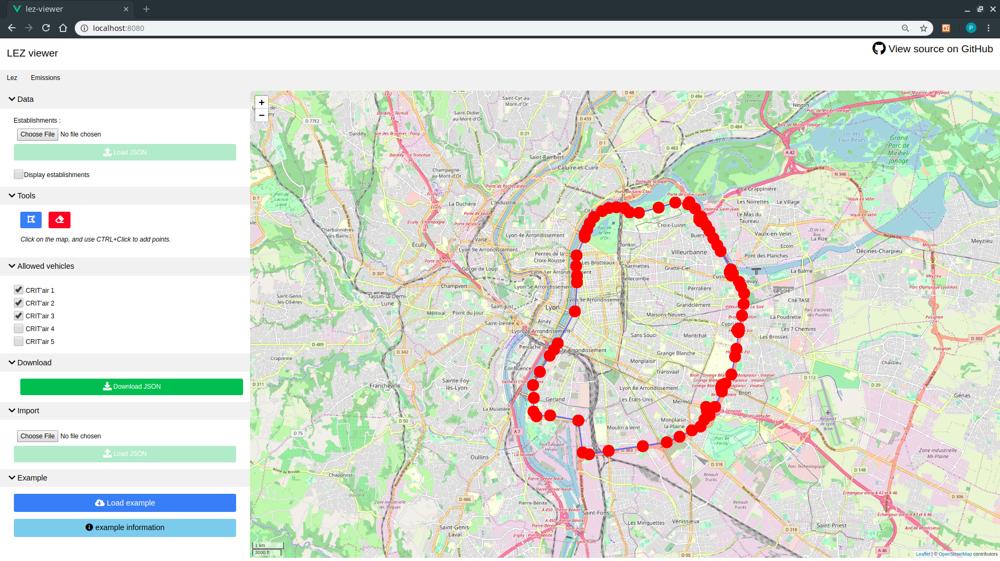

# lez-viewer :rainbow: :sheep:

This project has been designed in the context of the SmartGovLez project, in order to easily handle model inputs and outputs.

It allows the user to perform two main actions :



- Lez tab (input process) :
  - Design LEZ perimeter
  - Customize CritAir permissions
  - Export designed LEZ to a .json file
  - Import a previously designed LEZ
  


- Viewer tab (output process) :
  - Import SmartGovLez outputs (establishments and tiles)
  - Dynamic establishments and tiles interactions
  - Generate pollution maps by pollutants
  - Customize visualization parameters

# Manual

For more details about usage and [examples
information](https://github.com/smartgov-liris/lez-viewer/wiki/Examples), see
the [wiki of this
repository](https://github.com/smartgov-liris/lez-viewer/wiki/).


# Vue project setup
This project is a [Vue CLI](https://cli.vuejs.org/) project. The following commands are available from the root of the project to compile sources. (make sure `npm` is installed)

## Install
```
npm install
```

## Compiles and hot-reloads for development
```
npm run serve
```

## Compiles and minifies for production
```
npm run build
```

## Customize configuration
See [Configuration Reference](https://cli.vuejs.org/config/).
