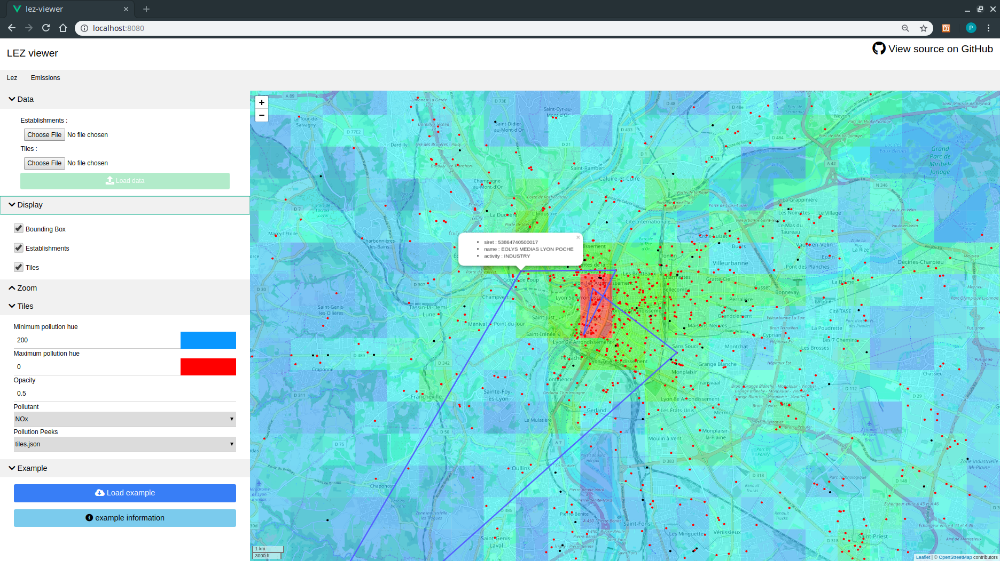
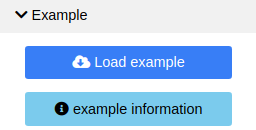

# lez-viewer


This project has been designed in the context of the SmartGovLez project, in order to easily handle model inputs and outputs.

It allows the user to perform two main actions :


- Lez tab (input process) :
  - Design LEZ perimeter
  - Customize CritAir permissions
  - Export designed LEZ to a .json file
  - Import a previously designed LEZ
  


- Viewer tab (output process) :
  - Import SmartGovLez outputs (establishments and tiles)
  - Dynamic establishments and tiles interactions
  - Generate pollution maps by pollutants
  - Customize visualization parameters
  
# Examples
Examples of input / output files can be found in [the examples folder](https://github.com/smartgov-liris/lez-viewer/tree/master/public/examples)

Those files are used by the **Load Example** buttons of the LEZ and Emissions tabs.



The provided example has the following characteristics:
- establisments :
  - 1371 establishments in the area of Lyon
  - 100 rounds among those establishments
- lez :
  - perimeter : load the example to check the perimeter
  - allowed Crit'Airs : 1, 2, 3
- tiles:
  - tile size : 1km
  - process (*SmartGovLez*) : **EURO1** vehicles have been considered, and those concerned by the LEZ (because they needed to deliver an establishment in the LEZ) have been replaced by **EURO6** vehicles.

## Vue project setup
This project is a [Vue CLI](https://cli.vuejs.org/) project. The following commands are available from the root of the project to compile sources. (make sure `npm` is installed)

### Install
```
npm install
```

### Compiles and hot-reloads for development
```
npm run serve
```

### Compiles and minifies for production
```
npm run build
```

### Run your tests
```
npm run test
```

### Lints and fixes files
```
npm run lint
```

### Customize configuration
See [Configuration Reference](https://cli.vuejs.org/config/).
