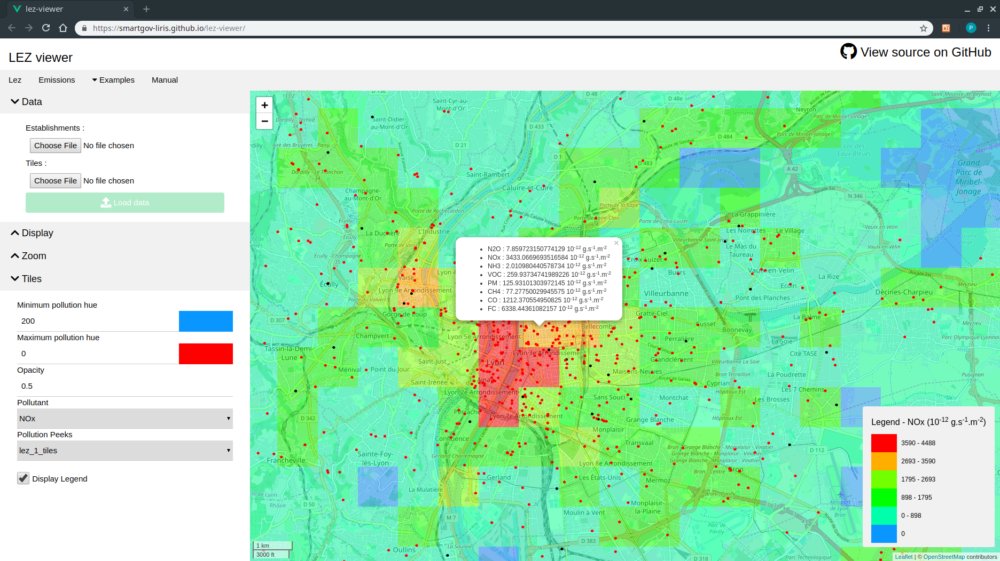
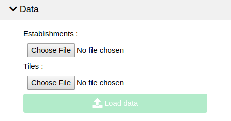
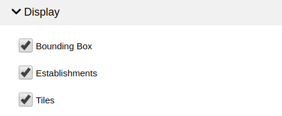
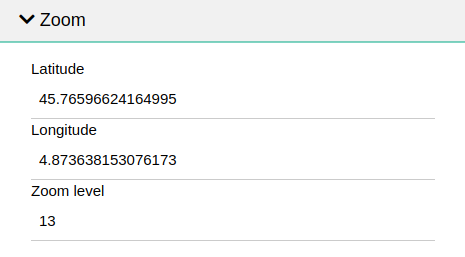
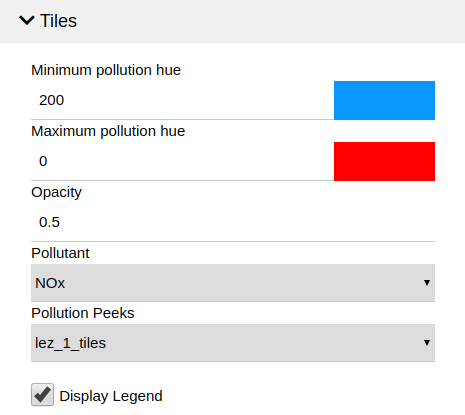
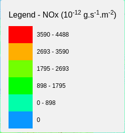

The `Emissions` tab allows you to visualize [SmartGovLezModelUFD output
tiles](https://github.com/smartgov-liris/SmartGovLezModelUFD/blob/master/documentation/outputs/Tile-Map-Generation.md#tile-map-generation)
with lots of convenient and dynamic features.

# Data

The emissions viewer can take as input :
- An establishments **output file**, as [produced by the SmartGovLezModelUFD](https://github.com/smartgov-liris/SmartGovLezModelUFD/blob/master/documentation/outputs/Standard-Outputs.md#establishments)
	(optional)
- A tiles file, as [generated by the SmartGovLezModelUFD](https://github.com/smartgov-liris/SmartGovLezModelUFD/blob/master/documentation/outputs/Tile-Map-Generation.md#tile-map-generation).

# Display

The `Display` pane allows you to choose which items to display on the rendered
map.

# Zoom

The `Zoom` pane provides inputs to define rendered map's center and zoom level.

# Tiles

The `Tiles` pane is used to customize tiles display parameters.

A 5 level color scale will be generated from the `Minimum pollution hue` to
`Maximum pollution hue` parameters. The `Minimum pollution hue` is used for
un-polluted tiles. The color scale is proportionnal to the pollution value for
the selected `Pollutant` of each tile, such that the `Maximum pollution hue` is
used for tiles that has a value equal to the maximum pollution value of the
`Pollution Peeks` file.

The `Pollution Peeks` parameter can be used to compare maps. The list is
incremented each time a new tiles file is loaded. Those files **should have
different names**. For example, when the `No LEZ` [example](Examples.md) is
loaded, and then the `LEZ 2` example is loaded, the `LEZ 2` tiles can be viewed
relatively to the `No LEZ` color scale, so that tiles should look lighter than
the ones on the `No LEZ` view, because pollution should have reduced. But the
`LEZ 2` tiles can also be viewed with its own color scale, if the objective is
to see the pollution distribution in this scenario for example.

The `Display Legend` input can be used to toggle the legend display on the map.
