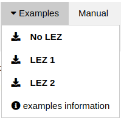

The `Examples` dropdown menu allows you to easily load simulation results that
has been established during the development of this project.

Examples of input / output files can be found in [the examples folder](../public/examples).

Once an example is loaded, the corresponding LEZ is loaded on the `LEZ` tab,
and generated tile maps are loaded in the `Emissions` tab.

The provided examples has the following characteristics :
- establishments : (Data provided by the
	[LAET](http://www.laet.science/?lang=en))
  - 1271 establishments in the area of Lyon
  - 100 rounds among those establishments
- lez :
  - perimeter : see the `LEZ` tab for each example. The `LEZ 2` perimeter has
	  been inspired by the city of Lyon
  - allowed Crit'Airs : 1, 2, 3
- tiles:
  - tile size : 1km
  - process (*SmartGovLez*) : **EURO1** vehicles have been considered, and those concerned by the LEZ (because they needed to deliver an establishment in the LEZ) have been replaced by **EURO6** vehicles.
- Vehicle fleet profiles (**by establishment**) :
  - Default profile :
    - 50% Light Commercial Vehicles and 50% Heavy Duty Trucks
    - Among the 50% Heavy Duty Trucks :
      - All vehicles are diesel powered
      - 20% Articulated and 80% Rigid vehicles
    - All the vehicles have a EURO1 Euro Norm.
  - Craftsmen and services :
    - EURO1 Light Weight vehicles only

The detailed [COPERT profile](https://github.com/smartgov-liris/SmartGovLezModelUFD/blob/master/documentation/inputs/COPERT-Profiles.md)
can be found in the [SmartGovLezModelUFD repository](https://github.com/smartgov-liris/SmartGovLezModelUFD/blob/master/input/establishment/fleetProfiles.json).

For the `LEZ 1` example, 18 establishments are concerned by the LEZ, so 18
**EURO1** vehicles have been replaced by **EURO6** vehicles.

For the `LEZ 2`, 27 establishments are concerned.

A complete sum up of the 3 examples (*No LEZ*, *LEZ 1* (or *intermediary* LEZ),
*LEZ 2* (or *final* LEZ)) is represented below :

