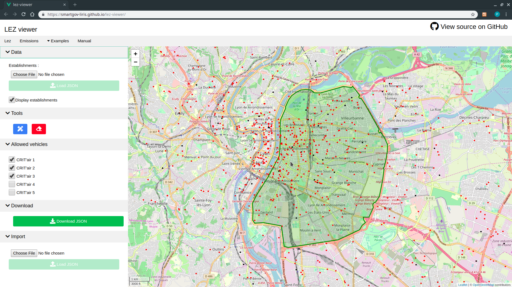
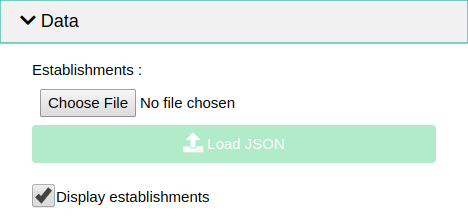
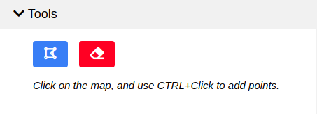
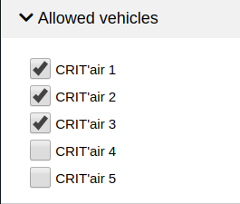
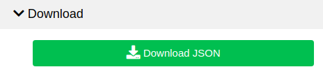
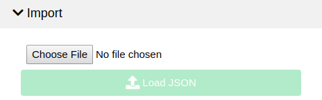

The LEZ editor allow users to draw and edit low emission zones perimeters, that
can then be downloaded and give as [input to the
SmartGovLezModel](https://github.com/smartgov-liris/SmartGovLezModel/wiki/lez).

# Input Data

Establishments can be imported, in order to visualize them editing the LEZ.
This is optional and has no impact on the LEZ output file.

Establishments should be **json output files** produced by the
[SmartGovLezModel](https://github.com/smartgov-liris/SmartGovLezModel/wiki/Standard-Outputs#establishments),
what should node be confused with establishments *input* data of the
SmartGovLezModel.

# Tools

The **blue button** allow you to switch between edit / view modes.

In `edit mode`, points can be added using **CTRL-L + Click**, and nodes can
also be moved around.

In `view mode`, the LEZ is viewed as a green polygon that is more convenient
for presentation screenshots for example.

The **red button** will delete all the current points.

# Allowed vehicles

Crit'Airs can be selected to specify which will be **allowed** to enter the LEZ
in the simulation.

# Download

The `Download` button can be used to download the current LEZ as a ready to use
[SmartGovLezModel LEZ input
file](https://github.com/smartgov-liris/SmartGovLezModel/wiki/lez#format).

# Import

The `Import` button can be used to load a previously created LEZ from the
corresponding generated JSON file.
